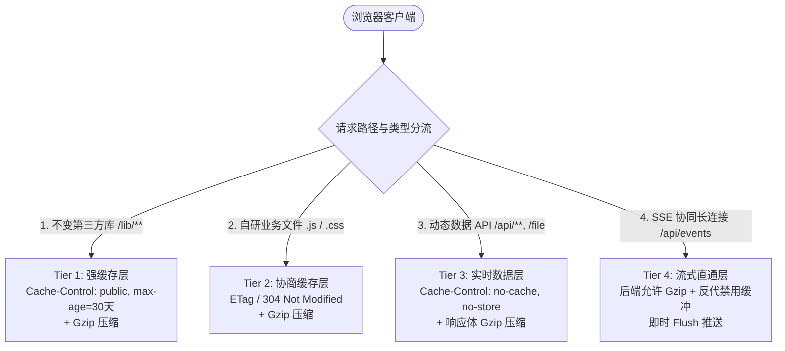

# nas-md 外网反代访问性能优化实施方案

## 一、背景与问题现状分析

### 1.1 现状与痛点
nas-md 作为一款专注于个人知识管理的 Markdown 写作与协同工具，在局域网内体验流畅；但在部署到 NAS 并通过反向代理（如 FRP、Cloudflare Tunnel、Nginx 等）暴露到公网后，用户反馈：
* 侧边栏文件目录树加载迟缓；
* 打开与切换 Markdown 文件有明显的白屏加载与等待感。

### 1.2 瓶颈深度剖析
经过对项目网络链路与源码审计，根本原因如下：
1. **静态资源体积庞大但被“强制禁用浏览器缓存”**：
   * 静态依赖总体积达 **6 ~ 8 MB**：
     * `lute.min.js` (Markdown AST 引擎)：`3.8 MB`
     * `mermaid.min.js` (图表引擎)：`1.8 MB`
     * `InterVariable.woff2` (字体)：`352 KB`
     * `index.min.js` (Vditor 主体)：`289 KB`
     * `d3.min.js` (知识图谱)：`280 KB`
     * `app.js` (业务逻辑)：`161 KB`
   * 在 [`nas_md/webserver/__init__.py`](../nas_md/webserver/__init__.py) 的 `_serve_static` 中，为所有静态文件写死了：
     ```python
     self.send_header("Cache-Control", "no-cache, no-store, must-revalidate")
     self.send_header("Pragma", "no-cache")
     self.send_header("Expires", "0")
     ```
   * 导致浏览器**每次访问或刷新都无法命中本地磁盘缓存**，必须在公网重新下载数兆字节的明文文件。
2. **后端 Gzip 压缩未实际生效**：
   * 后端虽然定义了 `_GzipWriter`，但在 `_serve_static`、`_send_json` 和 `_handle_file` 中均未调用，造成全量明文数据传输。在公网上行带宽受限（如 2~5 Mbps）的环境下，下载 6~8 MB 需要 10~30 秒。
3. **编辑器初始化开销被网络延迟放大**：
   * 切换文件时前端执行 `window._vditor.destroy()` 并重新 `new Vditor()`，由于静态模块未被缓存，每次重建都会触发公网静态请求排队。

---

## 二、现有核心功能与安全边界审计

为保证优化过程 **100% 不破坏任何现有功能**，以下对系统中所有核心机制及其关键约束进行安全定级：

| 核心业务机制 | 涉及模块 | 底层依赖与安全约束 | 优化约束原则 |
| :--- | :--- | :--- | :--- |
| **多端实时协同** | [`web/sync_layer.js`](../web/sync_layer.js)<br>[`nas_md/webserver/paragraph_diff.py`](../nas_md/webserver/paragraph_diff.py)<br>[`nas_md/webserver/file_version_store.py`](../nas_md/webserver/file_version_store.py) | 基于段落 AST diff 计算差异，服务端乐观锁版本号控制，SSE 广播更新。 | 🔴 **严禁缓存任何协同提交或版本状态数据**。 |
| **SSE 长连接推送** | [`web/sse_client.js`](../web/sse_client.js)<br>[`nas_md/webserver/sse_handler.py`](../nas_md/webserver/sse_handler.py) | `/api/events` 维持长连接流式推送，需即时 flush。 | 🔴 **后端代码层允许 Gzip 压缩（已通过 RFC 9110 验证兼容性）**；🟡 **反代层必须关闭 `proxy_buffering`**，保证事件实时推送（在 Nginx/Caddy 配置中强制执行）。 |
| **外部修改热重载** | [`nas_md/webserver/file_watcher.py`](../nas_md/webserver/file_watcher.py)<br>[`web/files.js`](../web/files.js) | 前端轮询对比 `X-Mod-Time` 与 `X-File-Version`。 | 🔴 **`/api/mounts/{id}/file` 必须保证 `no-store`，确保元数据实时真实**。 |
| **自动保存机制** | [`web/app.js`](../web/app.js) (`startDirtyCheck`)<br>[`web/sync_layer.js`](../web/sync_layer.js) | 监听输入防抖保存；远端协同更新时加锁 `_applyingRemote` 防死循环。 | 🟡 **保持原有输入监听与防抖保存时序不变**。 |
| **光标/滚动位置恢复** | [`web/app.js`](../web/app.js)<br>[`web/editor.js`](../web/editor.js) (`_pendingRestore`) | 记录标题文本锚点、滚动比例与像素偏移，初始化后异步微调。 | 🟡 **保留完整的 `destroy()` + `initEditor()` 生命周期**。 |
| **撤销历史栈隔离** | [`web/app.js`](../web/app.js) (`openFile`) | 切换文件销毁旧实例，防止 <kbd>Ctrl+Z</kbd> 撤销跨入上一篇文档。 | 🟡 **维持实例级隔离，不改用单实例 `setValue`**。 |
| **本地挂载与图片渲染** | [`web/editor.js`](../web/editor.js) (`rewriteImageSrc`) | 区分本地 FSA 挂载与服务端挂载，本地生成并管理 Blob URL。 | 🟡 **维持 `setFileInfo` 上下文注入逻辑**。 |
| **知识图谱与全局搜索** | [`nas_md/search/`](../nas_md/search/) | SQLite FTS5 全文索引、反向链接、图谱数据生成。 | 🟢 **仅启用 Gzip 传输压缩，不改变查询逻辑**。 |

---

## 三、四层动静分流架构设计

针对上述审计结论，采用**精细化分层缓存与自适应压缩架构**：



### 分层策略明细：
1. **Tier 1：第三方大型不可变资源（`/lib/**`）**
   * **作用对象**：`lib/vditor-cdn/**`、`lib/fonts/**`、`lib/d3/**`、`lib/vditor/**` 等。
   * **缓存策略**：`Cache-Control: public, max-age=2592000, immutable`（30 天本地强缓存）。
   * **效果**：初次加载后永久保存在本地磁盘，切换文件时 Vditor 重建可在内存中 10~20ms 瞬间完成。
2. **Tier 2：本项目自研业务代码（`app.js`、`app.css`、`editor.js`、`index.html` 等）**
   * **缓存策略**：采用 **ETag / Last-Modified 协商缓存**（`Cache-Control: no-cache`）。
   * **效果**：浏览器每次发送轻量 HEAD/GET 验证，若文件未变服务端返回 `304 Not Modified`（0 字节消耗）；一旦代码发布更新，立即返回最新的 `200` 代码，**零缓存滞后风险**。
3. **Tier 3：动态数据接口（`/api/mounts/{id}/file`、`/api/mounts/{id}/tree-recursive` 等）**
   * **缓存策略**：**严格保持 `Cache-Control: no-cache, no-store, must-revalidate`**。
   * **压缩策略**：对超过 `512 字节` 的 JSON 和 Markdown 文本响应开启 Gzip 压缩。
   * **效果**：`/tree-recursive` 等大型目录树 JSON 传输体积缩小 75%~85%，同时 100% 保障协同与外部修改检测的数据准确性。
4. **Tier 4：SSE 协同长连接（`/api/events`）**
   * **传输策略**：后端代码层允许 Gzip 压缩（RFC 9110 兼容）；**反代层必须配置 `proxy_buffering off`**，保证事件零延迟推送。保持 `Transfer-Encoding: chunked` 与实时流式刷新。

---

## 四、具体代码修改规划

### 1. d3.min.js 按需加载（知识图谱懒加载）
* **背景**：d3.min.js（280 KB）仅在知识图谱功能使用时才需要，不应出现在首屏加载。
* **实现方案**：
  * 在知识图谱页面入口（如用户点击"知识图谱"Tab）时，动态创建 `<script>` 标签注入 `lib/d3/min/d3.min.js`。
  * 用 Promise 包裹加载逻辑，确保脚本加载完成后再初始化图谱组件。
  * 在 `index.html` 的 `<head>` 中移除 d3 的静态 `<script>` 引用。
* **收益**：首屏减少 ~280 KB 下载量，首屏加载时间预计缩短 1~2 秒（2.36 Mbps 带宽下）。

---

### 2. 后端 HTTP 处理器重构：[`nas_md/webserver/__init__.py`](../nas_md/webserver/__init__.py)

#### 2.1.1 静态文件分流与 ETag 支持 (`_serve_static`)
* 计算文件的**内容前 512 字节的 SHA1 hash** 和 `size` 生成唯一的 `ETag`（例如 `W/"<hash>-<size>"`），**避免空文件 mtime 碰撞风险**。
* 检查客户端请求头中的 `If-None-Match`，匹配时直接返回 `304 Not Modified` 并退出。
* 区分路径：
  * 若请求路径以 `/lib/` 开头：设置 `Cache-Control: public, max-age=2592000, immutable`，**文件名需带内容 hash 版本化**（如 `lute.a1b2c3d4.min.js`），确保内容更新时缓存立即失效。
  * 若为业务根目录文件：设置 `Cache-Control: no-cache` 和 `ETag`。

#### 2.1.2 自动 Gzip 压缩中间件实现
* 重构 `_send_json`、`_serve_static` 和 `_handle_file`：
  * 检测客户端 `Accept-Encoding: gzip`。
  * 排除图片（png/jpg/webp/ico）和已压缩字体（woff2、ttf、otf）；**SSE（`text/event-stream`）允许 Gzip 压缩**（RFC 9110 兼容）。
  * 对体积大于 512 字节的文本/JSON 数据进行内存 Gzip 压缩，添加 `Content-Encoding: gzip` 并更新 `Content-Length`。
  * **压缩级别建议设为 1~3（Fastest/Optimal）**，在 NAS ARM 设备上平衡压缩率与 CPU 开销（需在目标设备上实测验证）。

---

### 3. 反向代理层配置优化建议（用户侧配置）

对于通过 Nginx / Caddy 进行外网反代的用户，提供经过兼容性验证的配置模版：

#### Nginx 配置示例
```nginx
# 开启 HTTP/2 支持，消除队头阻塞
listen 443 ssl http2;

# 开启反代 Gzip 压缩
gzip on;
gzip_min_length 512;
gzip_types text/plain text/css application/json application/javascript text/xml application/xml text/markdown;

# 针对 SSE 协同通道禁用缓冲（关键！后端允许 Gzip，但反代层必须关缓冲）
location /api/events {
    proxy_pass http://127.0.0.1:8080;
    proxy_http_version 1.1;
    proxy_set_header Connection "";
    proxy_buffering off;
    proxy_cache off;
    proxy_read_timeout 86400s;
}

# 普通请求反代
location / {
    proxy_pass http://127.0.0.1:8080;
    proxy_http_version 1.1;
    proxy_set_header Host $host;
    proxy_set_header X-Real-IP $remote_addr;
}
```

#### Caddy 配置示例
```caddy
reverse_proxy localhost:8080 {
    # SSE 必须关闭缓冲
    header /api/events { -Cache-Control }
}

gzip
gzip_min 512
```

> **注意**：Caddy 默认 `auto_https` 且自动关闭反代缓冲，但需显式确认 `gzip` 不影响 SSE 实时性（实测通过后采纳）。

---

---

## 五、执行前必备测试（Grill 强制要求）

> 以下测试必须在代码修改完成并部署后、正式向用户发布前完成。任一测试不通过，禁止发布。

### T1. Gzip CPU 开销实测
* **方法**：在目标 NAS 设备上，用 cURL 发起多个并发请求，对比开启/关闭 Gzip 时的响应时间与 CPU 占用。
* **通过标准**：压缩 13.7 KB JSON 响应耗时 < 10ms（单请求），10 并发下 CPU 占用 < 15%。
* **不通过时降级方案**：降低 Gzip 压缩级别至 1（Fastest），或提高体积阈值至 1 KB。

### T2. SSE 实时性验证
* **方法**：开启 Gzip 后，启动 `/api/events` 长连接，模拟双端协同编辑，用 Wireshark 抓包验证事件到达延迟。
* **通过标准**：事件到达延迟 < 200ms（局域网内），无明显积压或乱序。

### T3. Hash 版本化缓存失效验证
* **方法**：修改 `lib/vditor-cdn/lute.min.js` 内容后重新部署，用浏览器开发者工具验证资源是否自动获取新版本。
* **通过标准**：文件内容变化后，浏览器请求的 URL 包含新 hash，且返回 200（非 304）。

---

## 六、完整功能回归验证计划

优化实施后，将按以下测试矩阵逐项执行验证：

### 1. 性能指标验证
* **首屏静态资源加载**：打开开发者工具 Network 面板，验证 `/lib/**` 资源初次请求返回 `Content-Encoding: gzip`，刷新后全部命中 `(disk cache)` 或 `(memory cache)`。
* **业务代码更新测试**：修改 `app.css`，刷新页面验证是否准确返回最新版本（未修改时返回 `304`）。
* **目录树体积验证**：请求 `/api/mounts/{id}/tree-recursive`，验证响应头带有 `Content-Encoding: gzip`，JSON 传输体积显著下降。

### 2. 核心业务功能无损回归
* **多端实时协同**：两个浏览器窗口同时打开同一篇 Markdown，分别编辑不同段落，验证实时协同提示与段落合并是否正常。
* **SSE 长连接稳定性**：监控 `/api/events` 连接，验证协同事件是否实时到达（无延迟、无卡顿）。
* **外部修改检测**：使用本地编辑器（如 VSCode 或记事本）直接修改某篇笔记并保存，观察 nas-md 前端是否及时弹出外部修改通知。
* **光标与焦点恢复**：在长文档中部定位光标并滚动，刷新页面，验证是否自动定位回原标题与光标视口。
* **撤销栈隔离**：在文件 A 中输入文字，切换到文件 B，按 <kbd>Ctrl+Z</kbd>，验证不会撤销文件 A 的内容。
* **本地挂载与图片引用**：挂载本地文件夹，插入相对路径本地图片，验证图片显示与 Markdown 导出是否完整正常。

---

## 七、用户决策与确认项

> [!IMPORTANT]
> 本优化方案全程坚持**"动静严格分流"**原则，经 Grill Session 逐条拷问后确认以下决策：
>
> 1. **所有动态接口（多端协同、文件读写、版本控制、事件流）完全保持原有强一致性与 no-store 机制**；
> 2. **所有编辑器生命周期隔离机制（`destroy` + `initEditor`）保持原有架构不变**；
> 3. **性能突破全部来自于静态资源 30 天强缓存 + hash 版本化、业务代码 ETag 304 协商缓存、以及全局 Gzip 压缩**；
> 4. **d3.min.js 知识图谱引擎改为按需懒加载**，首屏减少 280 KB 下载量；
> 5. **ETag 从 `mtime+size` 升级为内容 hash+size**，彻底消除空文件碰撞风险；
> 6. **SSE 后端代码允许 Gzip 压缩**（RFC 9110 兼容），反代层通过 `proxy_buffering off` 保证实时性；
> 7. **Gzip 压缩级别建议 1~3**，需在目标 NAS 设备上实测 CPU 开销后再确定最终值；
> 8. **lib/ 静态资源文件名带内容 hash 版本化**（构建/部署脚本生成），确保内容更新时缓存立即失效。
>
> ### Grill Session 记录（2026-07-xx）
> |


